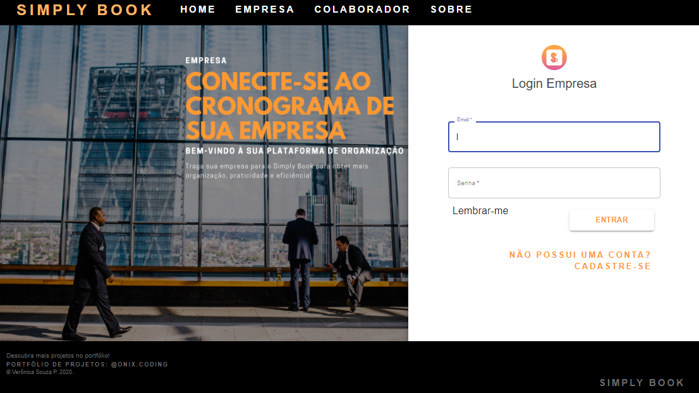

# Projeto Simply Book
   
O projeto ***SIMPLY BOOK*** foi desenvolvido para interação entre toda organização. 

Com o objetivo de centralizar todas as reuniões entre colaboradores da empresa, além de gerar uma maior organização e visibilidade dos passos tomados pela empresa. 

Tem como intuito dar a praticidade necessária para os processos. Para isto foi desenvolvida uma aplicação android com as seguintes funcões: Reserva de Salas (Marcar reuniões), Ampla vizualização do calendário da empresa e "Cardápio de Salas" e o Perfil básico.

Já está aplicação WEB, ainda está sendo desenvolvida com intuito de implementar a administração da empresa criação das salas, supervisão das reuniões e demais componentes.

## Background Do Projeto 

* **PÁGINA INICIAL**

* **EMPRESA**

* **COLABORADOR**

### Pré-requisitos

* Sistema Operacional 
     Microsoft Windows 7 (CORE I5)

### Ferramentas 

* IDE
    VSCODE Visual Studio Code

* Compilador 
    CMDER

### Instalando

No diretório do projeto (frontend), você pode executar:

**NPM RUN DEV**
Iniciali-za a construção do projeto no console, e ao final será exibido:
Executa o aplicativo no modo de desenvolvimento.
Abra http://localhost:8080 para visualizá-lo no navegador.

A página será recarregada se você fizer edições.
Você também verá erros de no console.

Inicia o corredor de teste no modo de observação interativo.
Consulte a seção sobre a execução de testes para obter mais informações.

**NPM RUN PRODUCTION**
Cria o aplicativo para produção na pasta de compilação.
Ele agrupa corretamente o React no modo de produção e otimiza a construção para obter o melhor desempenho.

Seu aplicativo está pronto para ser implantado!

## Built With

<!-- * [Dropwizard](http://www.dropwizard.io/1.0.2/docs/) - The web framework used
* [Maven](https://maven.apache.org/) - Dependency Management
* [ROME](https://rometools.github.io/rome/) - Used to generate RSS Feeds -->

## Contributing
...

## Versioning
    1.10.4-beta 

## Authors

* **Verônica Souza** - [Pórtfolio de Projeto informal](https://www.instagram.com/onix.coding/)

## Agradecimentos

* Agradeço pela ajuda de todos os colegas de projeto.
* Pela oportunidade de Trainee na Empresa Wisee.

